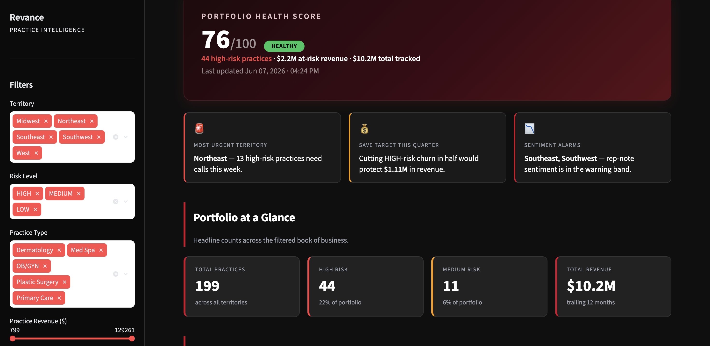
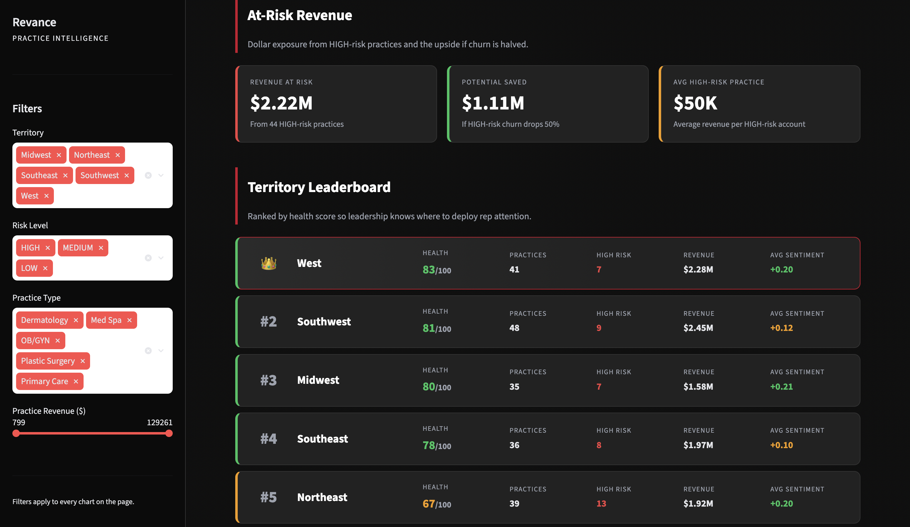
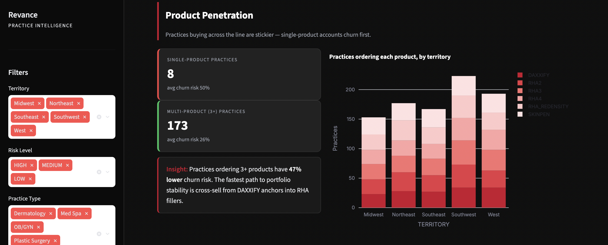
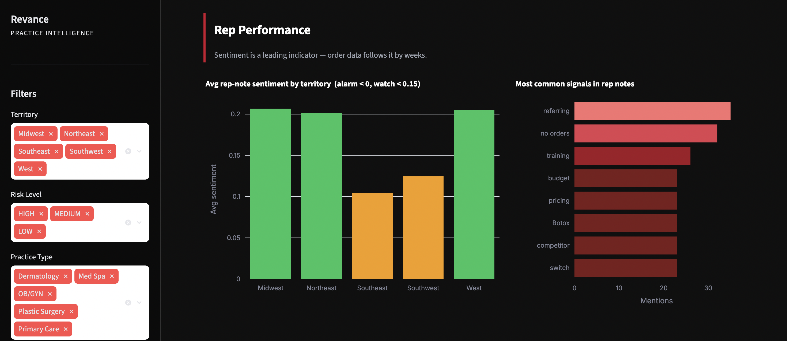
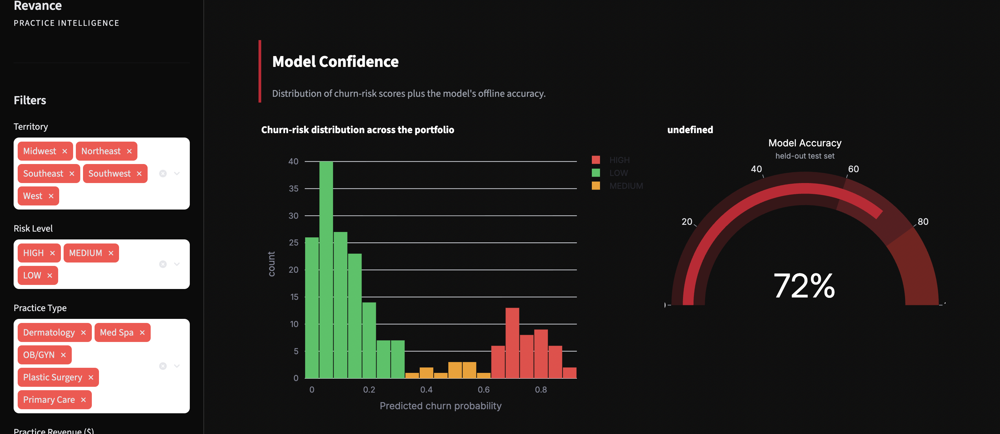
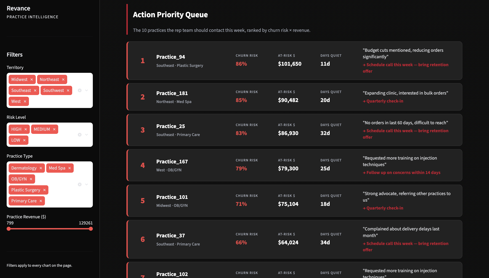
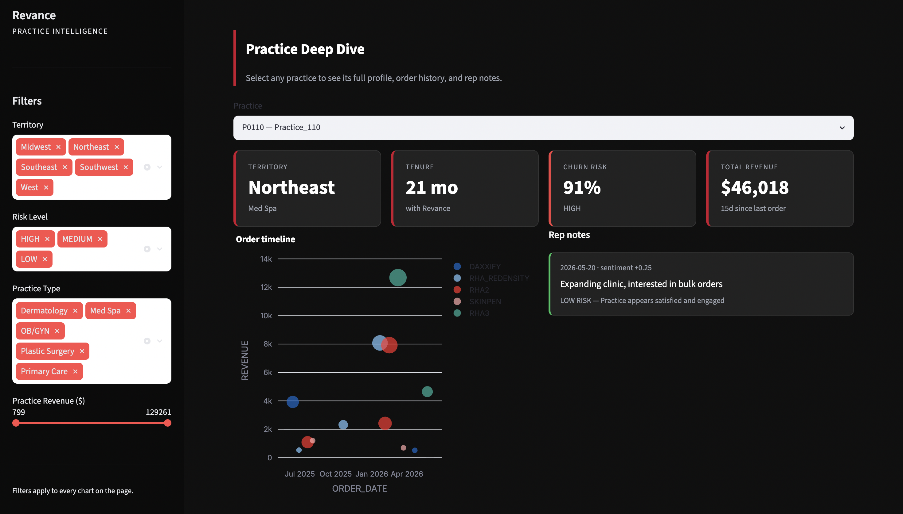

# Revance Practice Intelligence Pipeline

[](https://www.python.org/)
[](https://www.snowflake.com/)
[](https://scikit-learn.org/)
[](https://streamlit.io/)
[](#)

> An end-to-end Snowflake + ML pipeline that scores every Revance medical-aesthetics practice for churn risk, mines rep field notes for early-warning signals, and surfaces both in a live, enterprise-styled Streamlit dashboard.

---

## The problem

Aesthetic companies like Revance compete in a market where switching costs are low and competitive products (Botox, Juvederm, Restylane) are one phone call away. A dermatology practice that drifts from monthly DAXXIFY orders to quarterly orders has usually already had a conversation with a competitor — by the time the rep notices the dip in the CRM, the relationship is already lost.

Three structural pressures make churn prediction unusually high-value for this space:

1. **Long re-acquisition cycles.** Winning a med spa back after they switch takes 2–4 quarters and significant pricing concessions.
2. **High revenue concentration per account.** A single high-volume practice can represent six figures in annual revenue, so even a small reduction in churn rate produces outsized dollar impact.
3. **Qualitative signals lead the quantitative ones.** Reps hear "we're looking at Botox again" or "your delivery times have been bad" weeks before the order data moves. Capturing that signal requires NLP, not just SQL.

This project addresses all three: an ML model on order behaviour for the hard signal, sentiment + risk-tagging on rep notes for the soft signal, and a dashboard that unifies them into a weekly action queue.

---

## Architecture

```
Data Generation  →  Snowflake Tables  →  Snowpark ML  →  Sentiment Analysis  →  Streamlit Dashboard
   (synthetic         (raw + derived)      (Random          (TextBlob ≈            (live, Snowflake-
    practices,                              Forest           Cortex SENTIMENT)      backed, filtered)
    orders,                                 churn
    rep notes)                              scoring)
```

See [ARCHITECTURE.md](ARCHITECTURE.md) for the detailed ASCII data-flow diagram, component table, and Snowflake schema for all five tables.

---

## Tech stack

| Layer | Tool | What it does here |
|---|---|---|
| ❄️ **Warehouse** | Snowflake | Single source of truth — raw and derived tables |
| 🐼 **Compute** | Snowpark Python | Pulls features directly from Snowflake tables into pandas |
| 🌲 **Churn model** | scikit-learn `RandomForestClassifier` | Scores every practice with a churn probability |
| 💬 **NLP** | TextBlob (stand-in for Snowflake Cortex `SENTIMENT`) | Sentiment + rule-based risk tagging on rep notes |
| 📊 **Dashboard** | Streamlit + Plotly | Dark-themed enterprise UI with filters and action queue |
| 🧪 **Synthetic data** | pandas + numpy | 200 practices, ~2k orders, 200 rep notes |

---

## Project structure

```
revance_snowflake/
├── generate_data.py        # Synthesizes practices / orders / rep notes (200 / ~2k / 200)
├── setup_snowflake.py      # CREATE OR REPLACE tables + write_pandas bulk load
├── churn_model.py          # Snowpark + sklearn RF — writes CHURN_PREDICTIONS
├── cortex_analysis.py      # Sentiment + risk insight on rep notes — writes REP_NOTES_ANALYSIS
├── dashboard.py            # Streamlit + Plotly enterprise dashboard
├── config.py               # Snowflake credentials (git-ignored — see .env.example)
├── requirements.txt        # Python dependencies
├── .env.example            # Template for config.py values
├── ARCHITECTURE.md         # Data flow + Snowflake schema
├── README.md               # You are here
├── practices.csv           # Generated
├── orders.csv              # Generated
├── rep_notes.csv           # Generated
└── docs/
    └── screenshots/        # Dashboard screenshots used in this README
```

---

## Setup

### 1. Clone and install

```bash
git clone https://github.com/Likhith252002/revance-snowflake-intelligence.git
cd revance-snowflake-intelligence
python -m venv .venv && source .venv/bin/activate
pip install -r requirements.txt
```

### 2. Configure Snowflake credentials

Copy the template and create a real `config.py` (git-ignored):

```bash
cp .env.example .env   # for reference
```

Then create `config.py` in the project root:

```python
SNOWFLAKE_CONFIG = {
    "account":   "<your-account-locator>",
    "user":      "<your-username>",
    "password":  "<your-password>",
    "warehouse": "COMPUTE_WH",
    "database":  "SNOWFLAKE_LEARNING_DB",
    "schema":    "PUBLIC",
    "role":      "ACCOUNTADMIN",
}
```

### 3. Run the pipeline (in order)

Each step depends on tables written by the previous one:

```bash
python generate_data.py       # produces the three CSVs
python setup_snowflake.py     # creates raw tables and loads CSVs
python churn_model.py         # trains model, writes CHURN_PREDICTIONS
python cortex_analysis.py     # writes REP_NOTES_ANALYSIS
streamlit run dashboard.py    # launches the dashboard at http://localhost:8501
```

---

## Screenshots

### 1. Executive Summary — Portfolio Health Score and at-a-glance takeaways

The first thing leadership sees: a single **Portfolio Health Score** (76/100 here), the dollars at risk, and three callout cards that name the most-urgent territory, the realistic save target this quarter, and any territories where rep-note sentiment has drifted into the warning band. The KPI strip below it covers total practices, the HIGH/MEDIUM risk counts, and total revenue.



### 2. At-Risk Revenue + Territory Leaderboard

Translates the model output into dollars: how much revenue is at risk from HIGH-risk practices ($2.22M), the upside if churn is halved ($1.11M), and the average revenue per HIGH-risk account ($50K). The Territory Leaderboard ranks all five regions by health score with solid dark cards — West takes the crown, Northeast trails at 67 — so an Area Director knows exactly where their region falls.



### 3. Product Penetration

The "stickiness" view. Single-product practices (8 here) churn dramatically more than practices on 3+ products (173, 47% lower churn risk). The stacked bar shows product adoption by territory, making it obvious where the cross-sell motion has room to run. This reframes the cross-sell pitch from "let's grow the relationship" to "you're statistically safer when you anchor on more than one Revance product."



### 4. Rep Performance — sentiment and keyword signals

Sentiment is the leading indicator — it moves weeks before order volume does. Bars are colored by band (green ≥ 0.15, amber 0–0.15, red < 0), so a regional dip jumps out instantly. The right-side chart surfaces the most-mentioned keywords from the rep notes ("referring", "no orders", "training", "competitor", "Botox"…), giving leadership a qualitative read without reading every note.



### 5. Model Confidence

Distribution of churn-risk scores across the portfolio (green=LOW, amber=MEDIUM, red=HIGH) plus the model's offline accuracy as a gauge (72% on the held-out test set). Helps a sales leader judge how much to trust the priority ranking and where the borderline cases sit.



### 6. Action Priority Queue

The operational heart of the dashboard. Each row is a practice the rep team should contact this week, ranked by `churn_risk × revenue`. Every row carries the rank, territory, practice type, churn risk percent, at-risk dollars, days since last order, the most recent rep note (in quotes), and a colored recommended-action CTA. A rep walks in Monday and works the list top-down.



### 7. Practice Deep Dive

Pick any practice to see its full profile: territory, tenure, churn risk, total revenue, order timeline (sized by quantity, colored by product), and every rep note with a sentiment score. Useful for QBR prep, account reviews, and "why is this account flagged?" conversations.



---

## Key results

Run against the bundled synthetic dataset, the pipeline produces:

| Metric | Value |
|---|---|
| Practices scored | **200** |
| HIGH-risk practices flagged | **45** (≈ 22% of the book) |
| MEDIUM-risk practices flagged | **11** |
| Total revenue tracked | **$10.3M** (trailing 12 months) |
| Model accuracy (held-out test set) | **72%** |
| Territories covered | 5 (Northeast, Southeast, Midwest, West, Southwest) |
| Products tracked | 6 (DAXXIFY, RHA2/3/4, RHA Redensity, SkinPen) |
| Rep notes scored for sentiment | 200 |

---

## Business impact

For a Revance regional sales team, the output of this pipeline maps directly onto how a quarterly book gets worked:

- **Where to deploy rep time first.** The Action Priority Queue ranks accounts by `churn_risk × revenue`, so a rep walks into Monday already knowing the ten calls that protect the most dollars. Without this, prioritization is anecdotal.
- **A defensible at-risk revenue number for forecasting.** Instead of a gut estimate, leadership has a hard `at_risk_revenue` figure tied to the model output. That number goes into QBR slides and gives finance a concrete sensitivity for the next quarter.
- **Early warning from rep notes.** Sentiment + keyword tagging catches "switch", "competitor", "budget cuts", and "delivery" weeks before the order pattern moves — buying the rep team a real intervention window instead of a post-mortem.
- **Cross-sell as a retention lever.** The Product Penetration section makes it visible that practices on 3+ products churn meaningfully less than single-product accounts. That reframes the cross-sell pitch from "we'd like to grow the relationship" to "you're statistically safer when you anchor on more than one Revance product."
- **Territory accountability.** The Territory Leaderboard gives each Area Director a single ranked view of their region's health — useful in 1:1s and during territory rebalancing conversations.

The pipeline is not a replacement for the rep relationship. It's a way to make sure no high-value practice falls off the radar between Monday-morning syncs.
