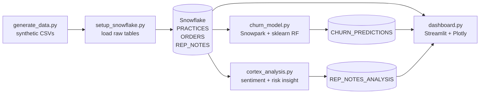
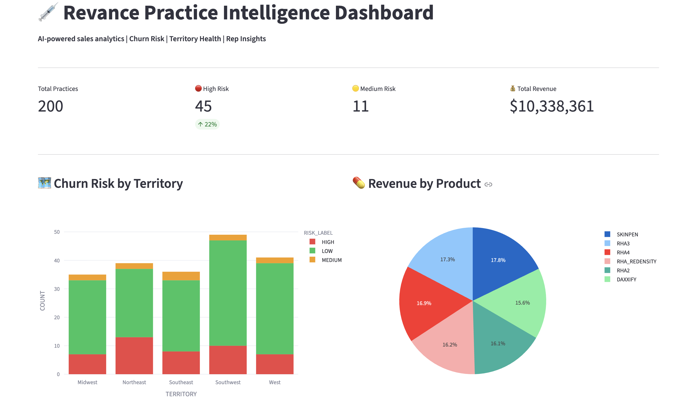
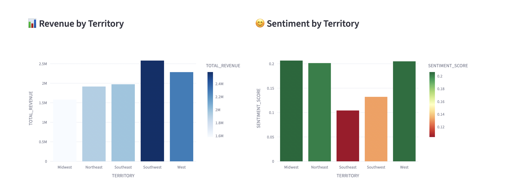
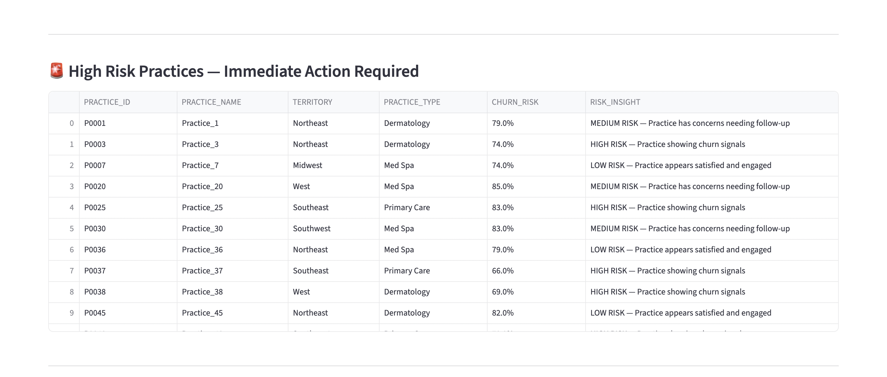
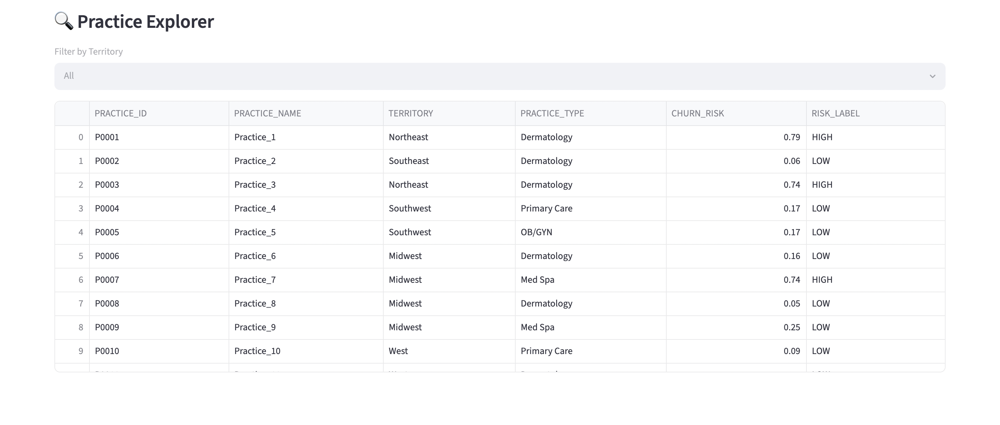

# Revance Practice Intelligence Pipeline

An end-to-end Snowflake ML and AI pipeline that predicts churn risk for medical aesthetics practices, scores sales-rep field notes for sentiment and risk signals, and surfaces both in a live Streamlit dashboard.

Built around a synthetic dataset modeled on Revance's commercial footprint — practices (dermatology, plastic surgery, med spa), orders across the DAXXIFY and RHA product lines, and weekly rep call notes.

---

## Overview

The pipeline answers three operational questions a commercial team cares about:

1. **Which practices are about to churn?** A Random Forest model trained on Snowpark-loaded order and tenure features scores every practice with a `CHURN_RISK` probability and a `HIGH / MEDIUM / LOW` label.
2. **What are reps telling us in the field?** Free-text rep notes are scored for sentiment (TextBlob, mimicking the `SNOWFLAKE.CORTEX.SENTIMENT` function) and tagged with a rule-based risk insight.
3. **Where should sales leadership focus this week?** A Streamlit dashboard joins the predictions, orders, and note analysis into territory- and product-level views with a high-risk action list.

All raw data, predictions, and analyses are persisted as Snowflake tables, so the dashboard reads from Snowflake at query time rather than from local files.

---

## Architecture



**Data flow**

| Stage | Script | Inputs | Outputs |
|---|---|---|---|
| Generate | `generate_data.py` | — | `practices.csv`, `orders.csv`, `rep_notes.csv` |
| Ingest | `setup_snowflake.py` | CSVs | `PRACTICES`, `ORDERS`, `REP_NOTES` |
| Model | `churn_model.py` | `PRACTICES`, `ORDERS` | `CHURN_PREDICTIONS` |
| Analyze | `cortex_analysis.py` | `REP_NOTES` | `REP_NOTES_ANALYSIS` |
| Serve | `dashboard.py` | all of the above | Streamlit UI |

---

## Tech stack

- **Warehouse / compute:** Snowflake (`COMPUTE_WH`), Snowpark Python
- **ML:** scikit-learn `RandomForestClassifier`, pandas feature engineering
- **NLP:** TextBlob sentiment (stand-in for Snowflake Cortex `SENTIMENT`), rule-based risk tagging
- **App:** Streamlit, Plotly Express
- **Connectors:** `snowflake-connector-python`, `snowflake-snowpark-python`

---

## Setup

### 1. Clone and install

```bash
git clone <repo-url>
cd revance_snowflake
python -m venv .venv && source .venv/bin/activate
pip install snowflake-connector-python snowflake-snowpark-python \
            pandas scikit-learn textblob streamlit plotly
```

### 2. Configure Snowflake credentials

Create `config.py` in the project root (it's git-ignored):

```python
SNOWFLAKE_CONFIG = {
    "account": "<your-account>",
    "user": "<your-user>",
    "password": "<your-password>",
    "warehouse": "COMPUTE_WH",
    "database": "SNOWFLAKE_LEARNING_DB",
    "schema": "PUBLIC",
    "role": "ACCOUNTADMIN",
}
```

### 3. Run the pipeline

Run in order — each step depends on tables from the previous one:

```bash
python generate_data.py       # produces the three CSVs
python setup_snowflake.py     # creates raw tables and loads CSVs
python churn_model.py         # trains model, writes CHURN_PREDICTIONS
python cortex_analysis.py     # writes REP_NOTES_ANALYSIS
streamlit run dashboard.py    # launches the dashboard
```

The dashboard opens at `http://localhost:8501`.

---

## Dashboard

The Streamlit app shows four KPI cards (total practices, high/medium-risk counts, total revenue), churn-risk by territory, revenue by product and territory, average sentiment by territory, a high-risk action list with the rep's most recent note, and a territory-filtered practice explorer.

### Screenshots

**Overview, KPIs, churn risk by territory, and product mix**

The header strip surfaces the four KPIs (200 practices, 45 high-risk, 11 medium-risk, ~$10.3M revenue) above a stacked churn-risk bar chart and a product-revenue pie. Southwest carries the heaviest practice count; SKINPEN and RHA3 lead the product split.



**Revenue and sentiment by territory**

Side-by-side territory views — Southwest leads on revenue (~$2.5M) but Southeast is the only territory where average rep-note sentiment dips into the warning band.



**High-risk practices — action list**

The merged table joins `CHURN_PREDICTIONS` with the rep's most recent note tag, so reviewers see both the modeled risk and the qualitative signal in one row.



**Practice explorer**

Territory-filtered table over every scored practice with its churn probability and bucket label.



---

## Repository layout

```
revance_snowflake/
├── generate_data.py        # synthetic practices / orders / rep notes
├── setup_snowflake.py      # create tables + load CSVs
├── churn_model.py          # Snowpark + sklearn churn model
├── cortex_analysis.py      # sentiment + risk insight on rep notes
├── dashboard.py            # Streamlit + Plotly UI
├── config.py               # Snowflake credentials (git-ignored)
├── practices.csv           # generated
├── orders.csv              # generated
└── rep_notes.csv           # generated
```

---

## Notes

- The dataset is fully synthetic; no real Revance customer data is used.
- `cortex_analysis.py` uses TextBlob locally to keep the demo runnable without Cortex entitlements. Swapping in `SNOWFLAKE.CORTEX.SENTIMENT(REP_NOTES)` via a SQL call is a one-line change.
- The Streamlit data load is cached with `@st.cache_data`; clear the cache from the app menu after re-running the model or analysis step.
